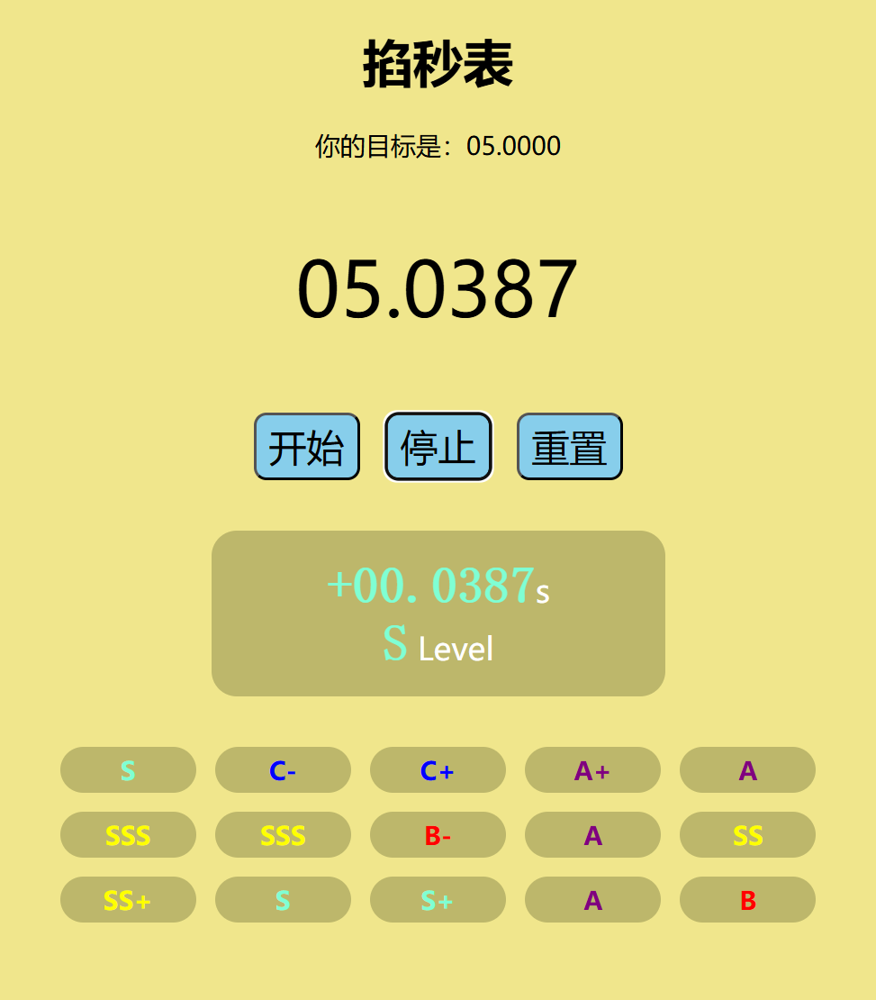

# Vanilla Gadgets

一个完全使用原生 HTML、CSS 和 JavaScript 构建的有趣小工具集合。没有框架，没有依赖，只有最纯粹的 Web 技术。



## 🌟 特性

- **纯原生实现**：不使用任何外部库或框架
- **轻量快速**：每个工具都保持最小的代码体积
- **跨平台**：在所有现代浏览器中都能完美运行
- **开源免费**：MIT 许可证，可自由使用和修改
- **响应式设计**：适应各种屏幕尺寸

## 🚀 项目列表

### 1. 爱心跳动 / Heart
2. 
一个跳动的心脏动画，使用纯 CSS 实现。通过简单的几何形状和关键帧动画，创造出生动的视觉效果。

**技术要点**：CSS 动画、伪元素、关键帧

### 2. 掐秒表 / Stopwatch Game

一个增强版掐秒表小游戏，精度达到 0.1 毫秒，包含评级系统和历史记录。测试你的反应时间！

**技术要点**：JavaScript 高精度计时、DOM 操作、本地存储

### 3. 快乐母鸡 / Hen & Egg

一个互动模拟游戏，母鸡会随机移动并下蛋，点击蛋可以孵化出新的母鸡。看看你能孵化多少只！

**技术要点**：JavaScript 事件处理、动态 DOM 创建、CSS 过渡

## 🛠️ 如何使用

### 方法一：直接访问

1. 克隆或下载本项目
2. 在浏览器中打开 `index.html`
3. 点击任意项目卡片开始体验

### 方法二：本地服务器

推荐使用本地服务器以获得最佳体验：

```bash
# Python 3
python -m http.server 8000

# 或使用 Node.js
npx serve
```

然后在浏览器中访问 `http://localhost:8000`

## 📁 项目结构

```
vanilla-gadgets/
├── index.html              # 主页面
├── README.md              # 项目说明
├── LICENSE               # 许可证文件
├── favicon.ico           # 网站图标
├── robots.txt            # 搜索引擎规则
├── heart/                # 爱心跳动项目
│   ├── index.html
│   └── favicon.svg
├── stopwatch-game/       # 掐秒表游戏项目
│   ├── index.html
│   ├── style.css
│   ├── index.js
│   ├── favicon.svg
│   └── screenshot.png
└── hen-egg/             # 快乐母鸡项目
    ├── index.html
    ├── hen.png
    └── egg.svg
```

## 🧪 技术栈

- **HTML5** - 语义化标记和结构
- **CSS3** - 现代样式、动画和响应式设计
- **JavaScript (ES6+)** - 交互逻辑和动态内容
- **无框架** - 纯原生实现，零依赖

## 🤝 贡献

欢迎提交 Issue 和 Pull Request！以下是一些贡献的方式：

1. **报告 Bug**：如果发现任何问题，请提交 Issue
2. **提出建议**：有新项目的想法或改进建议
3. **提交代码**：修复 Bug 或添加新功能
4. **改进文档**：完善 README 或添加注释

## 📄 许可证

本项目基于 Apache 2.0 许可证开源 - 查看 [LICENSE](LICENSE) 文件了解详情。
